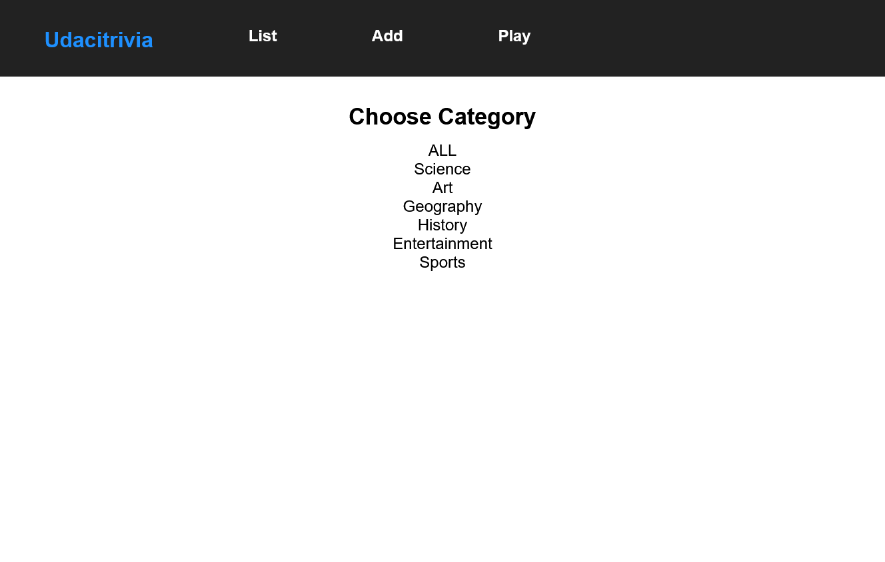
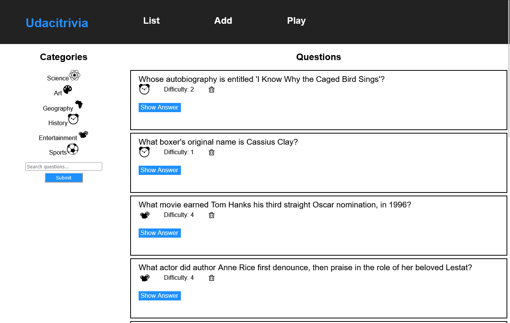

# Full Stack API Final Project: Trivia


## Full Stack Trivia

This project is a question/answer game, it has multiple functionalities such as:   

1. Display questions - both all questions and by category. Questions shows the question, category and difficulty rating by default and can show/hide the answer.
2. Delete questions.
3. Add questions and the corresponding answer.
4. Search for questions .
5. Play the quiz game, either all questions or within a specific category.


## Getting started
## Prerequisites and installation
## Backend :
The backend side contains a completed Flask and SQLAlchemy server.

#### Installing Dependencies for the Backend

1. **Python 3** - Follow instructions to install the latest version of python for your platform in the [python docs](https://docs.python.org/3/using/unix.html#getting-and-installing-the-latest-version-of-python)


2. **Virtual Enviornment** - We recommend working within a virtual environment whenever using Python for projects. This keeps your dependencies for each project separate and organaized. Instructions for setting up a virual enviornment for your platform can be found in the [python docs](https://packaging.python.org/guides/installing-using-pip-and-virtual-environments/)


3. **PIP Dependencies** - Once you have your virtual environment setup and running, install dependencies by naviging to the `/backend` directory and running:
```bash
pip install -r requirements.txt
```
This will install all of the required packages we selected within the `requirements.txt` file.


4. **Key Dependencies**
 - [Flask](http://flask.pocoo.org/)  is a lightweight backend microservices framework. Flask is required to handle requests and responses.

 - [SQLAlchemy](https://www.sqlalchemy.org/) is the Python SQL toolkit and ORM we'll use handle the lightweight sqlite database. You'll primarily work in app.py and can reference models.py. 

 - [Flask-CORS](https://flask-cors.readthedocs.io/en/latest/#) is the extension we'll use to handle cross origin requests from our frontend server. 

### Database Setup
With Postgres running, restore a database using the trivia.psql file provided. From the backend folder in terminal run:
```bash
psql trivia < trivia.psql
```
For windows:
```bash
psql -U username > trivia -f trivia.psql
```

### Running the server

From within the `./src` directory first ensure you are working using your created virtual environment.

before running the server, make sure to configure `models.py` with your corresponding database URI. 

To run the server, on the backend folder execute:

```bash
python -m app
```


## Frontend

### Installing Dependencies

1. **Installing Node and NPM**<br>
This project depends on Nodejs and Node Package Manager (NPM). Before continuing, you must download and install Node (the download includes NPM) from [https://nodejs.com/en/download](https://nodejs.org/en/download/).

2. **Installing project dependencies**<br>
This project uses NPM to manage software dependencies. NPM Relies on the package.json file located in the `frontend` directory of this repository. After cloning, open your terminal and run:
```bash
npm install
```
>_tip_: **npm i** is shorthand for **npm install**


### Running Your Frontend in Dev Mode

The frontend app was built using create-react-app. In order to run the app in development mode use ```npm start```. You can change the script in the ```package.json``` file. 

Open [http://localhost:3000](http://localhost:3000) to view it in the browser. The page will reload if you make edits.<br>

```bash
npm start
```

## Running tests
The application includes a file named `test_flaskr.py`.
This file contains multiple tests for each endpoint.
To run the tests , make sure first to change the database URI with your corresponing database URI. The using your command line , cd to the project main folder, then run these commands:
```bash
dropdb trivia_test
createdb trivia_test
psql trivia_test < trivia.psql
python test_flaskr.py
```
Feel free to to explore the test file.

## API reference :
The API Reference file is located on the '```\backend\api_reference.md```' directory.

## Screenshots




